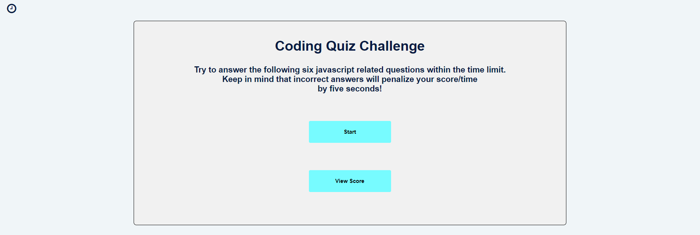
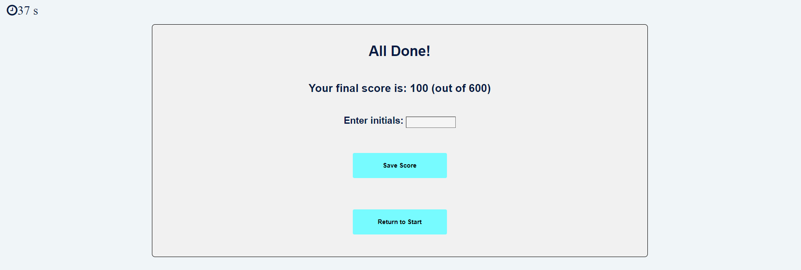
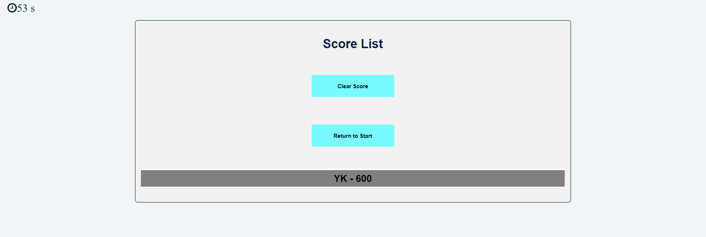

# Create a Javascript Quiz

## Project Task
Build a timed coding quiz with multiple-choice questions to become familiar with the coding tests and apply the skills


## How does this application work?
When the user first open the application, he/she will be brought to the *Start Page*.


### *Start Page:*
At this page, the user can select the options below:
1. Start a new quiz/game -> *Quiz Page*
2. Check the score list -> *Score List Page*


### *Quiz Page:*
At this page:
1. A series of JavaScript questions will be presented to the user with 4 answers.
2. A 60 seconds timer will start counting down.
3. Once the answer is selected, a bar pop up to indicate the results (correct or incorrect) of the answer for 2     seconds and then move to the next questions.
4. If the answer is correct, a 100 point will be added to the score.
5. If the answer is incorrect, 5 seconds will be subtracted from the countdown timer
6. If all questions are answered or the time (60 seconds) elapsed, it will move to the -> *End Page*


### *End Page:*
At this page:
1. The count down timer will be stopped.
2. The result of the quiz will be shown. 
3. Provide an option to record the score with user's initials -> *Score List Page*.
4. Return to the main page -> *Start Page*


### *Score List Page:*
At this page, the user can:
1. View the score history.
2. Clear the history from the database.
3. Return to the start page.


## User Story

```
A coding boot camp student wants to take a timed quiz on JavaScript fundamentals that 
stores high scores so that the student can gauge his progress compares to the peers.
```

## Acceptance Criteria

```
This application should include:
1. A timer starts when the quiz starts.
2. A series of questions will be presented to the user.
3. If the user selects the incorrect answer, 5 seconds will be subtracted from the clock.
4. Quiz is completed when all questions are answered or the timer reaches 0.
5. User can save their initials and score at the end of the quiz
```

## Moke Up

The following image shows the web application's appearance:

*Start Page:*


*Quiz Page:*


*End Page:*


*Score List Page:*


## URL
https://ykuang321.github.io/Javascript-Quiz/