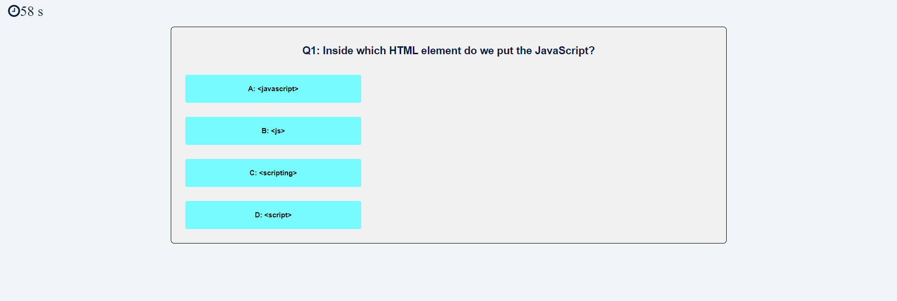

# Create a Javascript Quiz

## Project Task

Build a timed coding quiz with multiple-choice questions to become familiar with the coding tests and apply the skills


## How does this application work?
When the user first open the application, he/she will be brought to the **Start Page**.


### *Start Page:
At this page, the user can select the options below:
1. Start a new quiz/game -> **Quiz Page**
2. Check the score list -> **Score List Page**


### *Quiz Page:
At this page:
1. A series of JavaScript questions will be present to the user with 4 answers.
2. A sixty seconds timer will start counting down on the upper right corner.
3. Once the answer is selected, it will pop up a bar indicates the results (correct or incorrect) of the answer for 2 seconds and then move to the next questions.
4. If the answer is correct, a 100 point will be added to the score.
5. If the answer is wrong, five seconds will be subtract from the countdown timer
6. If all questions are answered or the time (60 seconds) elapsed, it will move to the -> **End Page**


### *End Page:
At this page:
1. The counter timer will be stopped.
2. The result of the quiz will be shown. 
3. Provide the user to record the score (with their initials) or try again -> **Start Page**.
4. Return to the main page.


### *Score List Page:
At this page, the user can:
1. View the score history.
2. Clear the history from the database.
3. Return to the main page.


## User Story

```
A coding boot camp student wants to take a timed quiz on JavaScript fundamentals that 
stores high scores so that the student can gauge his progress compares to the peers.
```

## Acceptance Criteria

```
GIVEN I am taking a code quiz
WHEN I click the start button
THEN a timer starts and I am presented with a question
WHEN I answer a question
THEN I am presented with another question
WHEN I answer a question incorrectly
THEN time is subtracted from the clock
WHEN all questions are answered or the timer reaches 0
THEN the game is over
WHEN the game is over
THEN I can save my initials and score
```

## Moke Up

The following image shows the web application's appearance:

*Start Page:*


*Quiz Page:*


*End Page:*


*Score List Page:*


## URL
https://ykuang321.github.io/Javascript-Quiz/